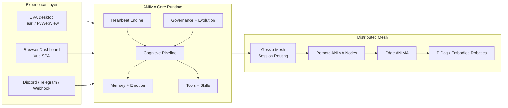

[English](README.md) | [中文](README_ZH.md)

<p align="center">
  
</p>

<h1 align="center">ANIMA</h1>

<p align="center"><strong>Heartbeat-driven, distributed, embodied AI life architecture.</strong></p>

<p align="center">
  ANIMA is built as a persistent AI organism rather than a stateless chat box:
  one EVA desktop, many networked nodes, and embodied edge runtimes such as PiDog.
</p>

<p align="center">
  <a href="docs/EDGE_ANIMA.md">Edge ANIMA</a>
  ·
  <a href="docs/ROBOTICS_PIDOG.md">PiDog Robotics</a>
  ·
  <a href="#quick-start">Quick Start</a>
  ·
  <a href="#architecture-at-a-glance">Architecture</a>
</p>

<p align="center">
  
  
  
  
  
</p>

## One-Sentence Pitch

> ANIMA is a heartbeat-driven AI life system: a persistent EVA desktop, a distributed node mesh, and embodied edge runtimes that share memory, emotion, tools, and network presence.

## 30-Second Intro

Most AI projects are request-response interfaces.  
ANIMA is shaped more like a living runtime.

It keeps an internal heartbeat, maintains layered memory, tracks emotional state, observes its environment, uses tools, joins a distributed mesh, and can extend itself into other machines or robots. The desktop EVA is the supervisory face of the system. Edge nodes let the same architecture move into Linux devices and robot-dog platforms.

If you need a simple way to explain it in a demo:

- ANIMA is not just a chat UI.
- It is a full AI runtime with persistence, introspection, networking, and embodiment.
- EVA is the desktop expression of that runtime.

## Why ANIMA Feels Different

- **Heartbeat first**: ANIMA has ongoing internal rhythms for observation, reflection, and long-cycle evolution.
- **Stateful by design**: memory, emotion, activity, and system context persist across turns.
- **Distributed from the start**: nodes can discover each other over LAN or Tailscale and coordinate across a mesh.
- **Embodied when needed**: PiDog and future edge platforms are treated as ANIMA-compatible bodies, not bolt-on peripherals.
- **Built for growth**: governance, sandboxing, and evolution systems make architecture change a first-class concern.

## What You Can Show In A Demo

- Talk to EVA in the desktop app or browser and inspect the internal runtime instead of only the final reply.
- Watch heartbeat, memory, emotion, tools, and activity streams update in real time.
- Discover other nodes on the same network and chat across the mesh.
- Control PiDog directly from EVA or from network-node conversations with commands such as `sit down`, `stand up`, and `look around`.
- Deploy a new node onto a configured laptop or robot target with a selected runtime profile.
- Reproduce the runtime onto another configured node from ANIMA itself while keeping per-machine secrets outside git.
- Deploy an edge runtime onto a Linux robot node and let it operate as an embodied ANIMA endpoint.

## System Shape

| Runtime | What It Does | Typical Host |
| --- | --- | --- |
| **Desktop Supervisor** | Main EVA experience, orchestration, dashboard, chat, tools, settings, network workbench | Windows desktop |
| **Headless ANIMA Node** | Browser/API runtime without the native window | Desktop, server, laptop |
| **Edge ANIMA** | Lightweight embodied runtime for robot platforms | Linux edge device, PiDog host |

<a id="architecture-at-a-glance"></a>

## Architecture At A Glance



## Core Capabilities

### 1. Cognitive Runtime

- Multi-stage cognitive pipeline for perception, routing, memory retrieval, tool use, and response handling
- Multi-user session isolation
- Configurable model cascade and fallback logic
- Governance modes for activity intensity, safety, and drift control

### 2. Memory, Emotion, and State

- SQLite-backed persistent memory plus ChromaDB document/vector retrieval
- Working memory, static knowledge, lorebook support, and conversation summarization
- Emotion state modeled as continuous runtime state rather than one-off labels
- Runtime snapshots that make internal system state visible in the dashboard

### 3. EVA Desktop Experience

- Native desktop shell plus browser-accessible dashboard
- Chat, memory, soulscape, evolution, network, robotics, and settings views
- Voice bridge, TTS/STT hooks, and embodied control surfaces
- A presentation-friendly control center rather than a single chat pane

### 4. Distributed Network

- ZMQ gossip mesh for node presence and lightweight coordination
- Cross-node chat and delegation
- Node discovery across the same LAN or Tailscale
- Direct robot-node bridges when a full remote EVA is not appropriate

### 5. Embodied Robotics

- PiDog modeled as an ANIMA-compatible embodied node
- Direct control through REST APIs and built-in tools
- EVA desktop can command actions, speech, status checks, and exploration
- Edge runtime profile for robot-side deployment and autonomy

<a id="quick-start"></a>

## Quick Start

### Desktop and Headless Runtime

```bash
# Windows one-click launcher
ANIMA.bat

# Desktop app (PyWebView native window)
python -m anima

# Headless backend (browser / API / WebSocket)
python -m anima --headless

# Legacy terminal mode
python -m anima --legacy

# Edge ANIMA runtime for robot nodes
python -m anima --edge
```

### Frontend and Desktop Shell

```bash
# Vue dashboard
cd eva-ui
npm install
npm run dev

# Build the Vue dashboard
cd eva-ui
npm run build

# Tauri desktop shell
cd eva-desktop
npm run dev
npm run build
```

### Edge Deployment

```bash
# Package and deploy the edge runtime to a robot-side Linux host
python -m anima spawn user@host --edge --profile edge-pidog

# Deploy to a configured known node from local/env.yaml
python -m anima spawn --node pidog

# Deploy a standard desktop/headless profile to another known node
python -m anima spawn --node laptop --profile default
```

The intended pattern is:

- commit reusable runtime profiles in `config/profiles/*.yaml`
- keep machine-specific addresses, SSH credentials, peers, and per-node overrides in `local/env.yaml`
- let `spawn --node ...` or the built-in `spawn_remote_node` tool inject ANIMA onto another configured node without committing sensitive data

## Repository Guide

| Path | Purpose |
| --- | --- |
| `anima/` | Python backend, APIs, core cognition, memory, networking, robotics, governance |
| `eva-ui/` | Vue 3 dashboard and operator-facing interface |
| `eva-desktop/` | Tauri desktop shell for native packaging |
| `agents/eva/` | EVA identity, rules, memory, examples, and style constraints |
| `config/` | Shared config and committed runtime profiles |
| `docs/` | Design notes for edge deployment, PiDog embodiment, and system strategy |
| `tests/` | API, robotics, dashboard, network, and runtime tests |

## Documentation Pointers

- [docs/EDGE_ANIMA.md](docs/EDGE_ANIMA.md): how edge runtimes are profiled, packaged, and deployed
- [docs/ROBOTICS_PIDOG.md](docs/ROBOTICS_PIDOG.md): PiDog platform design, control model, and exploration behavior

## Good Fits For ANIMA

- Persistent AI assistant experiments
- Embodied AI and robotics orchestration
- Distributed EVA-style multi-machine systems
- Research demos that need internal visibility, not just a final answer
- Personal AI companions with memory, personality, and operational tooling

## Current Project Status

ANIMA is active, ambitious, and already demoable, but it is still an evolving system rather than a hardened production platform. The strongest current story is the combination of:

- desktop EVA,
- node-to-node networking,
- embodied PiDog control,
- edge ANIMA deployment,
- and a runtime that exposes its internal structure instead of hiding it.

## License

[MIT](LICENSE)
