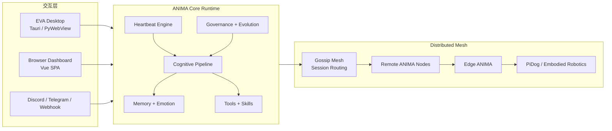

[English](README.md) | [中文](README_ZH.md)

<p align="center">
  
</p>

<h1 align="center">ANIMA</h1>

<p align="center"><strong>一个以心跳为节律、可分布式扩展、可具身化落地的 AI 生命架构。</strong></p>

<p align="center">
  ANIMA 不是一个一次一答的聊天框，
  而是一套持续运行的 AI 生命系统：
  一个 EVA 桌面端，多个网络节点，以及像 PiDog 这样的 edge 具身终端。
</p>

<p align="center">
  <a href="docs/EDGE_ANIMA.md">Edge ANIMA</a>
  ·
  <a href="docs/ROBOTICS_PIDOG.md">PiDog 机器狗平台</a>
  ·
  <a href="#quick-start">快速开始</a>
  ·
  <a href="#architecture-at-a-glance">架构总览</a>
</p>

<p align="center">
  
  
  
  
  
</p>

## 一句话介绍

> ANIMA 是一个以心跳驱动的 AI 生命系统：桌面 EVA 是中枢，分布式节点是网络，edge 具身终端是身体，它们共享记忆、情绪、工具能力和网络存在。

## 30 秒版本

大多数 AI 项目，核心是“输入一句话，返回一句话”。  
ANIMA 的核心则是“让 AI 作为一个持续运行的系统存在”。

它有自己的心跳节律、记忆层、情绪状态、环境感知、工具调用、网络节点和具身层。  
EVA 桌面端是它最直观的可视化表达。  
edge ANIMA 则让同一套架构可以进入 Linux 设备、机器狗和未来更多具身平台。

如果你要对外快速介绍，可以直接这样说：

- ANIMA 不是普通聊天机器人。
- 它是一套具备持续状态、可解释内部结构、可联网、可具身的 AI 运行架构。
- EVA 是这套架构在桌面端的可视化和交互入口。

## 为什么 ANIMA 值得看

- **有心跳，不是纯请求驱动**：系统会按节律持续观察、思考、整理状态。
- **有状态，不是一次性回答**：记忆、情绪、活动状态会持续积累和影响后续行为。
- **天然支持分布式**：不同节点可以在 LAN 或 Tailscale 中发现彼此并协作。
- **天然支持具身化**：PiDog 这类平台不是外挂设备，而是 ANIMA 的身体节点。
- **天然支持演化**：治理、沙箱、进化机制都是架构级能力，而不是后补功能。

## 这个项目适合怎么演示

- 在桌面端与 EVA 对话，同时展示它的心跳、记忆、情绪和活动流
- 打开网络工作台，看到其他节点在同网或 Tailscale 上上线
- 直接对 PiDog 发出“坐下”“站起来”“看看周围”这类自然语言指令
- 按配置好的目标节点与 profile，把新的 ANIMA runtime 注入到笔记本或机器人节点
- 在不提交敏感信息的前提下，从 ANIMA 自身继续向其他已知节点“繁殖”新的 runtime
- 把 edge ANIMA 部署到机器狗 Linux 节点，让它成为一个可联网的具身端
- 通过 dashboard 展示这不是一个黑箱聊天界面，而是一个完整运行中的 AI 系统

## 系统形态

| 运行形态 | 作用 | 典型宿主 |
| --- | --- | --- |
| **Desktop Supervisor** | EVA 主界面、编排中枢、dashboard、聊天、设置、网络工作台 | Windows 桌面端 |
| **Headless ANIMA Node** | 无原生窗口的后端节点，可通过浏览器/API 使用 | 台式机、服务器、笔记本 |
| **Edge ANIMA** | 面向机器人和终端设备的轻量具身运行档位 | Linux edge 设备、PiDog 侧宿主 |

<a id="architecture-at-a-glance"></a>

## 架构总览



## 核心能力

### 1. 认知运行时

- 多阶段认知流水线，覆盖感知、事件路由、记忆检索、工具调用、响应生成
- 多会话隔离，便于多人或多来源同时接入
- 多模型级联与降级策略
- 治理模式可控制系统活跃度、安全性和人格漂移

### 2. 记忆、情绪与持续状态

- 基于 SQLite 的持久记忆与 ChromaDB 文档检索
- 工作记忆、静态知识、lorebook、会话摘要等多层能力
- 情绪不是单次标签，而是持续影响系统行为的运行时状态
- dashboard 可直接看到内部状态快照，而不只是最后一句回复

### 3. EVA 桌面端

- 原生桌面外壳 + 浏览器可访问 dashboard
- 聊天、记忆、人格、进化、网络、机器人、设置等页面
- 语音桥、TTS/STT 接入、具身控制入口
- 更像一个 AI 控制台，而不是单一聊天窗口

### 4. 分布式网络

- 基于 ZMQ gossip 的节点发现与轻量协作
- 跨节点聊天与任务委托
- 支持 LAN / Tailscale 发现
- 对机器人节点提供 direct bridge，而不是强行要求完整远端桌面实例

### 5. 具身机器人

- PiDog 被建模为 ANIMA 兼容的具身节点
- 可通过 REST API 和内置工具直接控制
- EVA 桌面端可直接下发动作、语音、状态查询和探索行为
- 已支持面向机器人侧部署的 edge 运行档位

<a id="quick-start"></a>

## 快速开始

### 桌面端与无界面运行

```bash
# Windows 一键启动
ANIMA.bat

# 桌面应用
python -m anima

# 无窗口后端（浏览器 / API / WebSocket）
python -m anima --headless

# 传统终端模式
python -m anima --legacy

# 面向机器人节点的 edge 运行档位
python -m anima --edge
```

### 前端与桌面壳

```bash
# Vue dashboard
cd eva-ui
npm install
npm run dev

# 构建前端
cd eva-ui
npm run build

# Tauri 桌面端
cd eva-desktop
npm run dev
npm run build
```

### Edge 部署

```bash
# 将 edge 运行时打包并部署到机器人侧 Linux 主机
python -m anima spawn user@host --edge --profile edge-pidog

# 从 local/env.yaml 的已知节点配置直接部署到 PiDog
python -m anima spawn --node pidog

# 将标准桌面/无界面档位部署到另一台已知节点
python -m anima spawn --node laptop --profile default
```

推荐的整理方式是：

- 可复用的运行档位放在 `config/profiles/*.yaml`
- 每台机器自己的地址、SSH 凭据、peer 和本地覆盖放在 `local/env.yaml`
- 通过 `spawn --node ...` 或内置工具 `spawn_remote_node` 把 ANIMA 注入到其他已知节点，而不是把敏感部署细节写进仓库

## 仓库导览

| 路径 | 作用 |
| --- | --- |
| `anima/` | Python 后端，包含 API、认知核心、记忆、网络、机器人、治理与进化 |
| `eva-ui/` | Vue 3 dashboard 和操作界面 |
| `eva-desktop/` | Tauri 桌面外壳 |
| `agents/eva/` | EVA 的身份设定、规则、记忆和风格约束 |
| `config/` | 共享配置和已提交的运行 profile |
| `docs/` | edge、机器人平台、架构设计文档 |
| `tests/` | API、网络、机器人、dashboard、运行时测试 |

## 文档入口

- [docs/EDGE_ANIMA.md](docs/EDGE_ANIMA.md)：edge 运行档位、打包和部署方式
- [docs/ROBOTICS_PIDOG.md](docs/ROBOTICS_PIDOG.md)：PiDog 平台设计、控制接口和探索策略

## 适合 ANIMA 的方向

- 持续运行的 AI 助手或陪伴型系统
- 具身 AI 与机器人控制中枢
- 多机器协作的 EVA 风格节点网络
- 需要展示内部状态而不只是输出结果的研究演示
- 具备人格、记忆、工具链和运行状态的个人 AI 系统

## 当前项目状态

ANIMA 已经具备很强的演示性和架构完整度，但它仍然是一套持续演进中的系统，而不是“已经完全产品化封装完毕”的平台。它当前最强的展示点在于：

- EVA 桌面端，
- 分布式节点网络，
- PiDog 具身控制，
- edge ANIMA 部署能力，
- 以及把 AI 的内部运行结构直接暴露出来这一点。

## 许可证

[MIT](LICENSE)
